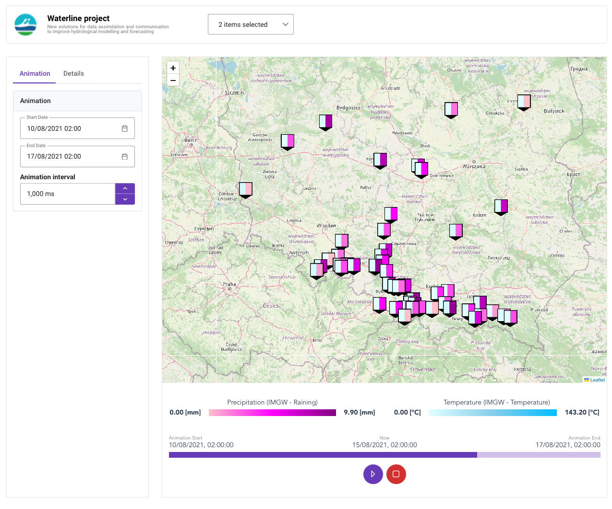

# Waterline Data Visualizer



Waterline Data Visualizer is a web application for visualizing and analyzing hydrological data. It provides an interactive interface to explore and interpret measurements efficiently.

## Features

- Visualize water quality data on interactive charts and graphs.
- Filter and aggregate data by various parameters such as time, location, and sensor.
- Compare multiple datasets for in-depth analysis.
- Export visualizations and reports.

## Getting Started

### Prerequisites
- Node.js (version: 20.5.0)
- npm (version: 9.8.0)
- pnpm

### Deployment
0. Install prerequisites:
  * node and npm can be installed using this link: https://docs.npmjs.com/downloading-and-installing-node-js-and-npm
  * pnpm can be installed using command: `npm install -g pnpm`
1. Install git CLI: [https://git-scm.com/downloads](https://git-scm.com/downloads)
2. Clone this repository:
    ```bash
    git clone https://github.com/WaterlinePL/waterline-data-visualizer-enhanced.git
    ```
3. Project setup (install packages)
    ```
    pnpm install
    ```
4. Build production version (builds frontend, copies server JS file and copies default data directory)
    ```
    pnpm build
    ```
5. Run webserver (runs server.js script to serve webserver) with data from `dist/data` directory:
    ```
    pnpm serve [port_number]
    ```

By default the application can be accessed in web browser on `localhost:[port]`. Default port is `8080`, can be changed when starting the server.

### Development setup

1. Clone this repository:
    ```bash
    git clone https://github.com/WaterlinePL/waterline-data-visualizer-enhanced.git
    ```

2. Project setup
    ```
    pnpm install
    ```
   
3. Compiles and hot-reloads for development
    ```
    pnpm run serve
    ```