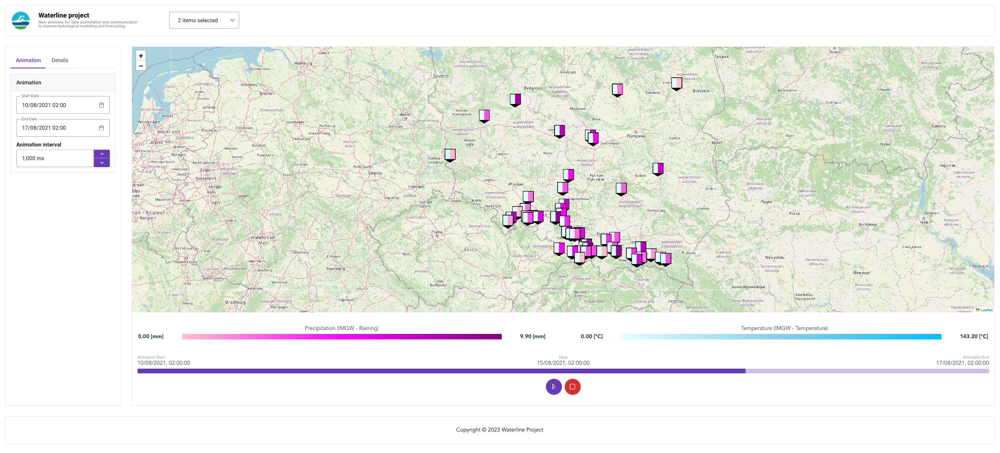

# Waterline Data Visualizer



Waterline Data Visualizer is a web application for visualizing and analyzing hydrological data. It provides an interactive interface to explore and interpret measurements efficiently.

## Features

- Visualize water quality data on interactive charts and graphs.
- Filter and aggregate data by various parameters such as time, location, and sensor.
- Compare multiple datasets for in-depth analysis.
- Export visualizations and reports.

## Getting Started

### Prerequisites
- Node.js (version: 20.5.0)
- npm (version: 9.8.0)
- vue (version: 3.3.4)

### Installation

1. Clone this repository:
    ```bash
    git clone https://github.com/wojdzie/waterline-data-visualizer.git
    ```

2. Project setup
    ```
    pnpm install
    ```
   
3. Compiles and hot-reloads for development
    ```
    pnpm run serve
    ```